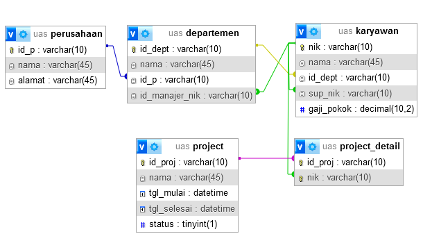
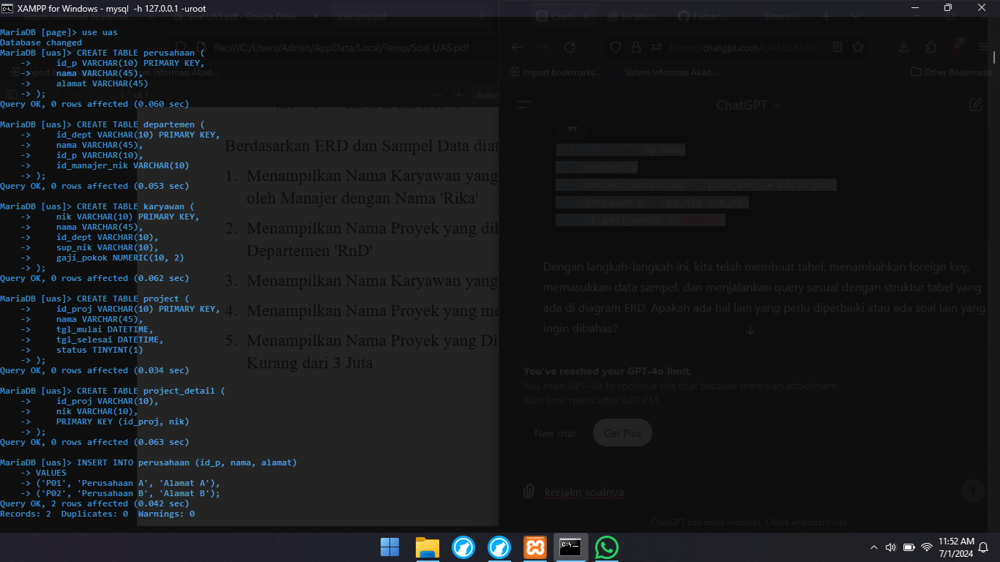
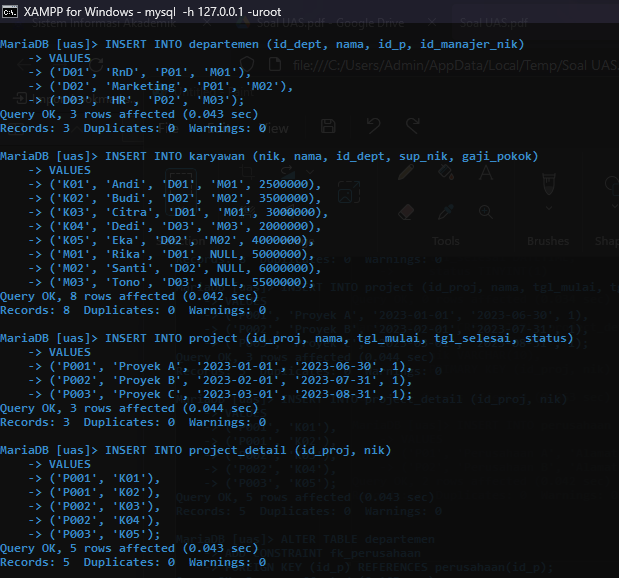
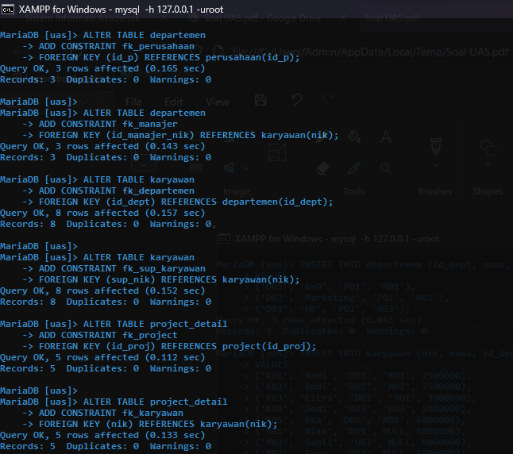
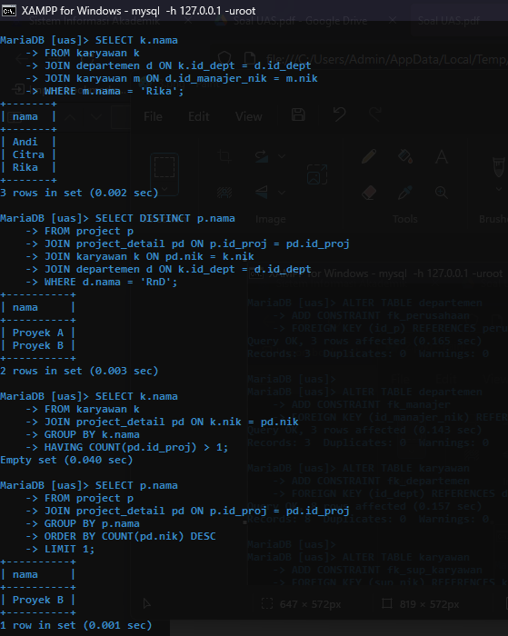
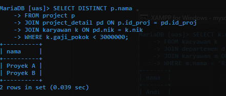

# UAS - Pertemuan ke 16
# Tugas Pertemuan ke 16 { UAS } 


|**Nama**|**NIM**|**Kelas**|**Matkul**|
|----|---|-----|------|
|Fadzar Surya Wijaya|312310451|TI.23.A.5|Basis Data|

# Table



# Create Table



# Create Foreign Key



# Latihan UAS
### 1: Menampilkan Nama Karyawan yang Berada di Departemen yang Dipimpin oleh Manajer dengan Nama 'Rika'

```
SELECT k.nama
FROM karyawan k
JOIN departemen d ON k.id_dept = d.id_dept
JOIN karyawan m ON d.id_manajer_nik = m.nik
WHERE m.nama = 'Rika';
```

### 2: Menampilkan Nama Proyek yang dikerjakan oleh Karyawan dari Departemen 'RnD'

```
SELECT DISTINCT p.nama
FROM project p
JOIN project_detail pd ON p.id_proj = pd.id_proj
JOIN karyawan k ON pd.nik = k.nik
JOIN departemen d ON k.id_dept = d.id_dept
WHERE d.nama = 'RnD';
```

### 3: Menampilkan Nama Karyawan yang Terlibat dalam Lebih dari Satu Proyek

```
SELECT k.nama
FROM karyawan k
JOIN project_detail pd ON k.nik = pd.nik
GROUP BY k.nama
HAVING COUNT(pd.id_proj) > 1;
```

### 4: Menampilkan Nama Proyek yang melibatkan Karyawan terbanyak

```
SELECT p.nama
FROM project p
JOIN project_detail pd ON p.id_proj = pd.id_proj
GROUP BY p.nama
ORDER BY COUNT(pd.nik) DESC
LIMIT 1;
```

### 5: Menampilkan Nama Proyek yang Diikuti oleh Karyawan dengan Gaji Pokok Kurang dari 3 Juta

```
SELECT DISTINCT p.nama
FROM project p
JOIN project_detail pd ON p.id_proj = pd.id_proj
JOIN karyawan k ON pd.nik = k.nik
WHERE k.gaji_pokok < 3000000;
```

